**Binary Code:** It is weighted code .i.e. it is a code in which weight is assigned to every symbol position in the code word. The positional weights in binary code are shown below:

Binary Code :-----> …..   24 &nbsp;   23 &nbsp;   22 &nbsp;  21 &nbsp;  20 &nbsp;  2-1 &nbsp;  2-2 &nbsp;  2-3 &nbsp;  2-4   …

Decimal ----------> …..  16  &nbsp;  8  &nbsp;  4  &nbsp;  2 &nbsp;    1  &nbsp;  1/2  &nbsp;  1/4   &nbsp;  1/8 &nbsp;  1/16 …

**Gray Code:** It is a non-weighted code i.e. it does not have any specific/fixed weight assigned to each symbol position in the code word. The unique feature of Gray code is that at a time only “one” bit changes In other words, in Gray code every new code differs from the previous in terms of one single bit.

Use of Gray Code: For correct measurement of angular position of shaft.

 

**Design:** The Binary and their equivalent Gray Codes are related as shown in Fig.1

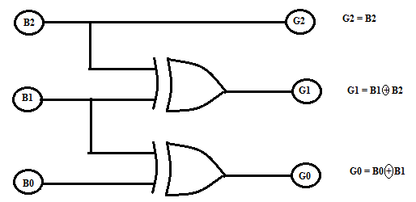

Fig.1. Logic Diagram showing relation between Binary and Gray Code.

 

 

Let us now prepare the 3 bit- Binary to 3 bit Gray code truth table:

 
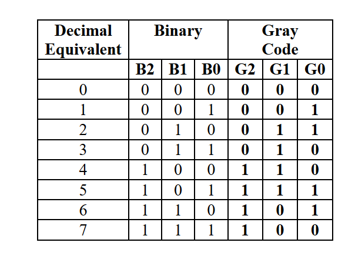
 
	

From the truth table it is observed that the output G2 is HIGH for minterms m4, m5, m6 and m7. Hence equation defining G2 output can be written as: G2 = Σ m (4, 5, 6, 7). The output G1 is HIGH for minterms m2 and m3 m4 & m5. Hence equation defining G1 output can be written as: G1 = Σ m (2, 3, 4, 5). The output G0 is HIGH for minterms  m1, m2  m5 m6. Hence equation defining G1 output can be written as: G0 = Σ m (1, 2, 5, 6). The Gray outputs for given 3 bit Binary are summarized as follows:

G2 = Σ m (4, 5, 6, 7)

G1 = Σ m (2, 3, 4, 5)

G0 = Σ m (1, 2, 5, 6)

The above Boolean expressions can be implemented using IC 74LS138 as a 3:8 decoder by just connecting its relevant outputs to  4- input NAND gates as shown in Fig. 1.Four input IC74LS20 is used to produce the final Gray code equivalent.

 
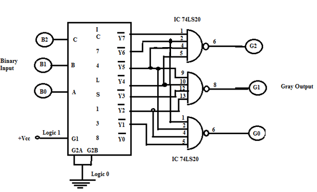

Fig. 2. Binary to Gray Code Converter using IC 74LS138

 

The logic diagram, connection diagram and function table for IC 74LS138 are given below:

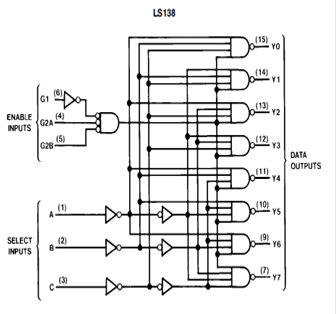

Fig.3. Logic Diagram, Connection Diagram & Function Table of IC 74LS138.

 
#### Numerical:

 Formulas:
Inputs => 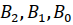

Outputs => 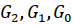

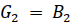

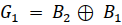

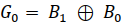

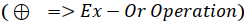

Ex-Or Operation Table:

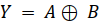

Truth table:

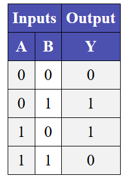

Examples:

    Input “011”

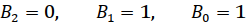

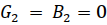

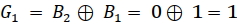

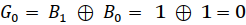

    Output = “010”
  
  Input “110”

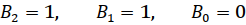

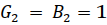

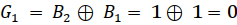

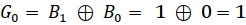

    Output = “101”

    Input “111”

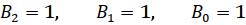

    Output = “100”

 
